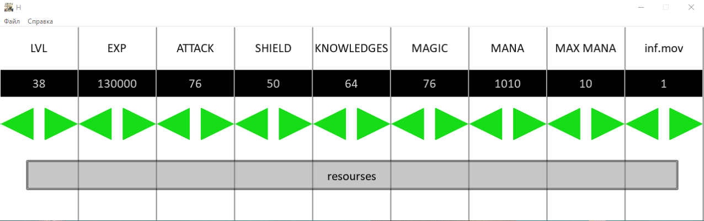
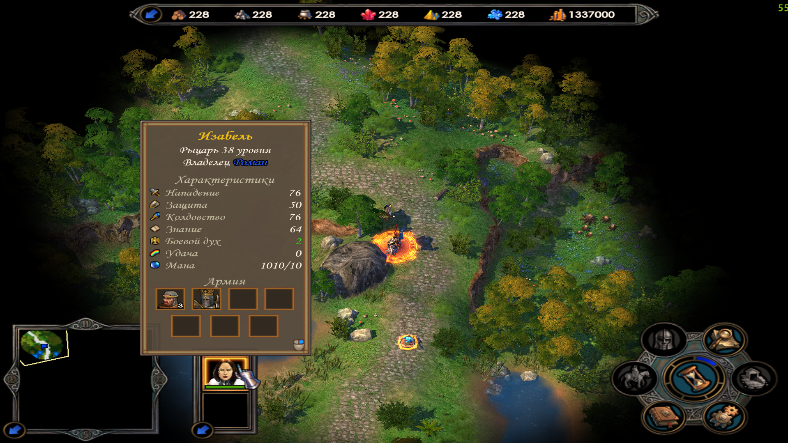

# HOMM5Trainer
trainer for Heroes of Might &amp; Magic V(version 1.6)
## how to run:
compile the program in release x86 using Microsoft Visual Studio 2018+
open the HOMM5, start the game
run the release's .exe app
### functions:
- lvl manipulating
- mana manipulating
- attributes manipulating
- moves manipulating
- resources manipulating
### Show case:

## note for programmers:
the code is fucking trash (+ trash multithreading)
Collision of Triangles = Collision of Rect
project should be ported to QT 5.xx

